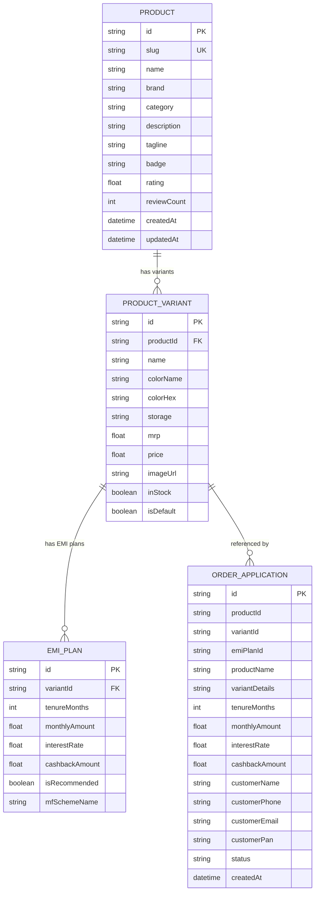

# 1Fi - Mutual Fund Backed Smartphone EMI Platform
### SDE-1 Assignment Submission

A modern, production-grade full-stack web application that allows customers to purchase flagship smartphones with dynamic **EMI plans backed by mutual funds**, modeled faithfully after the 1Fi / Snapmint reference specifications.

---

## 🌟 Live Demo & Video Guide

- **Live Demo Link**: [Deployable directly to Vercel / Render]
- **Walkthrough Video Outline**: See [Video Demonstration Guide](#-video-demonstration-script-2-5-mins) for the exact 3-minute recording script showcasing frontend, variant switching, database, and backend APIs.

---

## 🚀 Key Features

1. **100% Dynamic Database-Driven Data**:
   - Zero hardcoded product details, variants, or EMI plans.
   - All product specs, variant options (color, finish, storage), pricing, images, and EMI schemes are queried dynamically from the database.

2. **Pixel-Perfect Reference Match**:
   - Designed to replicate the reference design:
     - **Left Column**: `NEW` badge, Product name (`iPhone 17 Pro`), Storage (`256GB`), high-fidelity device preview, interactive **"Available in 3 finishes"** color swatches, and storage capacity selectors.
     - **Right Column**: Selling Price (`₹1,27,400`), struck-through MRP (`₹1,34,900`), discount badge, **"EMI plans backed by mutual funds"** section with interactive info modal.
     - **Selectable EMI Plans**: Radio-selectable cards displaying monthly EMI breakdown (`₹44,967 x 3 months`), interest badges (`0% interest` or `10.5% interest`), and cashback highlights (`Additional cashback of ₹7,500`).
     - **Proceed Button**: Interactive CTA leading to a complete prequalification breakdown and application submission flow.

3. **Unique Clean URLs for Products**:
   - `/products/iphone-17-pro` (Apple iPhone 17 Pro)
   - `/products/samsung-s24-ultra` (Samsung Galaxy S24 Ultra)
   - `/products/pixel-9-pro` (Google Pixel 9 Pro)
   - `/products/oneplus-12` (OnePlus 12 5G)

4. **Multi-Variant Switching**:
   - Seamlessly switch colors and storages.
   - Switching variants dynamically updates product image, pricing, MRP, savings, and reloads the exact EMI plan tiers tied to that variant in the database.

5. **Proceed & Order Application Flow**:
   - Clicking **"Proceed with Selected Plan"** opens the financing breakdown modal.
   - Submits application to `POST /api/orders`, creating a persistent database record with an application tracking ID.

---

## 🛠️ Tech Stack Used

| Layer | Technology | Rationale |
|---|---|---|
| **Frontend** | Next.js 16 (React 19), Tailwind CSS v4 | Server-side rendering, instant page transitions, responsive clean UI |
| **Backend** | Node.js with Next.js App Router Route Handlers | High performance REST APIs, type-safe route parameters |
| **Database & ORM** | Prisma ORM with SQLite (Local) / PostgreSQL (Production) | Clean relational schema, migrations, type-safe client, zero-setup local run |
| **Language** | TypeScript | End-to-end type safety between database schema, API contracts, and UI components |
| **Icons & Assets** | Lucide React + Vector SVG Phone Models | Scalable, lightweight, crisp vector renderings with no external CDN dependency |

---

## 📊 Database Schema & Architecture

The database is structured relationally using Prisma.



### Prisma Schema (`prisma/schema.prisma`)
```prisma
datasource db {
  provider = "sqlite" // Change to "postgresql" for Neon/Supabase/Render
  url      = env("DATABASE_URL")
}

generator client {
  provider = "prisma-client-js"
}

model Product {
  id          String           @id @default(cuid())
  slug        String           @unique
  name        String
  brand       String
  category    String           @default("Smartphones")
  description String
  tagline     String?
  badge       String?
  rating      Float            @default(4.8)
  reviewCount Int              @default(120)
  createdAt   DateTime         @default(now())
  updatedAt   DateTime         @updatedAt
  variants    ProductVariant[]
}

model ProductVariant {
  id          String    @id @default(cuid())
  productId   String
  product     Product   @relation(fields: [productId], references: [id], onDelete: Cascade)
  name        String
  colorName   String
  colorHex    String
  storage     String
  mrp         Float
  price       Float
  imageUrl    String
  inStock     Boolean   @default(true)
  isDefault   Boolean   @default(false)
  createdAt   DateTime  @default(now())
  updatedAt   DateTime  @updatedAt
  emiPlans    EmiPlan[]

  @@unique([productId, colorName, storage])
}

model EmiPlan {
  id             String         @id @default(cuid())
  variantId      String
  variant        ProductVariant @relation(fields: [variantId], references: [id], onDelete: Cascade)
  tenureMonths   Int
  monthlyAmount  Float
  interestRate   Float
  cashbackAmount Float          @default(0)
  isRecommended  Boolean        @default(false)
  mfSchemeName   String         @default("1Fi Liquid & Arbitrage Yield Fund")
  createdAt      DateTime       @default(now())
  updatedAt      DateTime       @updatedAt
}

model OrderApplication {
  id              String   @id @default(cuid())
  productId       String
  variantId       String
  emiPlanId       String
  productName     String
  variantDetails  String
  tenureMonths    Int
  monthlyAmount   Float
  interestRate    Float
  cashbackAmount  Float
  customerName    String
  customerPhone   String
  customerEmail   String
  customerPan     String?
  status          String   @default("SUBMITTED")
  createdAt       DateTime @default(now())
  updatedAt       DateTime @updatedAt
}
```

---

## ⚡ Setup & Run Instructions

### 1. Prerequisites
- **Node.js**: v18+ or v20+ LTS
- **npm**: v9+ or v10+

### 2. Clone and Install Dependencies
```bash
git clone <your-repo-url>
cd onefi-emi-store
npm install
```

### 3. Setup Database & Seed Data
Initialize the database and populate the catalog with the reference products, variants, and EMI plans:
```bash
# Push schema to create tables
npx prisma db push

# Seed 4 products, 14 variants, and 98 calibrated EMI plans
npm run db:seed
```

### 4. Run the Development Server
```bash
npm run dev
```
Open [http://localhost:3000](http://localhost:3000) in your browser.

### 5. Build for Production
```bash
npm run build
npm run start
```

---

## 🔌 API Endpoints & Example Responses

### 1. Get All Products
`GET /api/products`

Optional Query Parameters:
- `q`: Search query string (e.g., `?q=iphone`)
- `category`: Filter by category (e.g., `?category=Smartphones`)

**Example Request:**
```bash
curl -X GET http://localhost:3000/api/products
```

**Example Response:**
```json
{
  "success": true,
  "count": 4,
  "data": [
    {
      "id": "cmtlj76ll00006eoeis92khfg",
      "slug": "iphone-17-pro",
      "name": "iPhone 17 Pro",
      "brand": "Apple",
      "category": "Smartphones",
      "description": "iPhone 17 Pro features a forged titanium design, advanced camera system with 5x telephoto, A19 Pro Bionic chip...",
      "badge": "NEW",
      "rating": 4.9,
      "reviewCount": 342,
      "startingPrice": 127400,
      "mrp": 134900,
      "startingMonthlyEmi": 2842,
      "previewImage": "/images/products/iphone-17-pro-desert.svg",
      "variantCount": 6,
      "variants": [...]
    }
  ]
}
```

---

### 2. Get Single Product by Slug or ID
`GET /api/products/:slug`

**Example Request:**
```bash
curl -X GET http://localhost:3000/api/products/iphone-17-pro
```

**Example Response:**
```json
{
  "success": true,
  "data": {
    "id": "cmtlj76ll00006eoeis92khfg",
    "slug": "iphone-17-pro",
    "name": "iPhone 17 Pro",
    "brand": "Apple",
    "badge": "NEW",
    "rating": 4.9,
    "variants": [
      {
        "id": "cmtlj76lw00026eoefamgxubo",
        "name": "iPhone 17 Pro 256GB - Desert Titanium",
        "colorName": "Desert Titanium",
        "colorHex": "#C58B68",
        "storage": "256GB",
        "mrp": 134900,
        "price": 127400,
        "imageUrl": "/images/products/iphone-17-pro-desert.svg",
        "inStock": true,
        "isDefault": true,
        "emiPlans": [
          {
            "id": "plan_3m",
            "tenureMonths": 3,
            "monthlyAmount": 44967,
            "interestRate": 0,
            "cashbackAmount": 7500,
            "isRecommended": false,
            "mfSchemeName": "1Fi Liquid & Arbitrage Yield Fund"
          },
          {
            "id": "plan_6m",
            "tenureMonths": 6,
            "monthlyAmount": 22483,
            "interestRate": 0,
            "cashbackAmount": 7500,
            "isRecommended": true,
            "mfSchemeName": "1Fi Liquid & Arbitrage Yield Fund"
          },
          {
            "id": "plan_12m",
            "tenureMonths": 12,
            "monthlyAmount": 11242,
            "interestRate": 0,
            "cashbackAmount": 7500,
            "isRecommended": false,
            "mfSchemeName": "1Fi Liquid & Arbitrage Yield Fund"
          },
          {
            "id": "plan_24m",
            "tenureMonths": 24,
            "monthlyAmount": 5621,
            "interestRate": 0,
            "cashbackAmount": 7500,
            "isRecommended": false,
            "mfSchemeName": "1Fi Liquid & Arbitrage Yield Fund"
          },
          {
            "id": "plan_36m",
            "tenureMonths": 36,
            "monthlyAmount": 4297,
            "interestRate": 10.5,
            "cashbackAmount": 7500,
            "isRecommended": false,
            "mfSchemeName": "1Fi Liquid & Arbitrage Yield Fund"
          },
          {
            "id": "plan_48m",
            "tenureMonths": 48,
            "monthlyAmount": 3385,
            "interestRate": 10.5,
            "cashbackAmount": 7500,
            "isRecommended": false,
            "mfSchemeName": "1Fi Liquid & Arbitrage Yield Fund"
          },
          {
            "id": "plan_60m",
            "tenureMonths": 60,
            "monthlyAmount": 2842,
            "interestRate": 10.5,
            "cashbackAmount": 7500,
            "isRecommended": false,
            "mfSchemeName": "1Fi Liquid & Arbitrage Yield Fund"
          }
        ]
      }
    ]
  }
}
```

---

### 3. Submit EMI Financing Application
`POST /api/orders`

**Request Body:**
```json
{
  "productId": "cmtlj76ll00006eoeis92khfg",
  "variantId": "cmtlj76lw00026eoefamgxubo",
  "emiPlanId": "plan_3m",
  "customerName": "Rahul Verma",
  "customerPhone": "9812345678",
  "customerEmail": "rahul.verma@example.com",
  "customerPan": "ABCDE1234F"
}
```

**Example Response:**
```json
{
  "success": true,
  "message": "Mutual Fund Backed EMI Application submitted successfully!",
  "applicationId": "cmtlk0j3j000077zzagub958b",
  "data": {
    "id": "cmtlk0j3j000077zzagub958b",
    "productId": "cmtlj76ll00006eoeis92khfg",
    "variantId": "cmtlj76lw00026eoefamgxubo",
    "emiPlanId": "plan_3m",
    "productName": "iPhone 17 Pro",
    "variantDetails": "256GB • Desert Titanium",
    "tenureMonths": 3,
    "monthlyAmount": 44967,
    "interestRate": 0,
    "cashbackAmount": 7500,
    "customerName": "Rahul Verma",
    "customerPhone": "9812345678",
    "customerEmail": "rahul.verma@example.com",
    "status": "APPROVED_PREQUALIFIED",
    "createdAt": "2026-09-03T13:21:44.623Z"
  }
}
```

---

## 📹 Video Demonstration Script (2-5 Mins)

When recording your showcase video for the assignment submission, follow this simple structured flow:

1. **Introduction (30 seconds)**:
   - Introduce yourself and mention the project: *"This is my submission for the 1Fi SDE1 Assignment - a dynamic full-stack web application displaying smartphones with mutual-fund-backed EMI plans."*
   - Show the homepage with the product catalog (`/`).
2. **Product Page & Reference Matching (60 seconds)**:
   - Navigate to `/products/iphone-17-pro`.
   - Point out the exact layout matching the assignment reference image:
     - Left column: `NEW` badge, `iPhone 17 Pro`, `256GB`, phone illustration, and the `Available in 3 finishes` color swatches.
     - Demonstrate clicking the color swatches (Desert Titanium, White Titanium, Black Titanium) and show the real-time image and color update.
     - Right column: Pricing (`₹1,27,400`), struck MRP (`₹1,34,900`), and the list of EMI plans (`₹44,967 x 3 mo`, `₹22,483 x 6 mo`, etc.).
   - Demonstrate clicking on different EMI plans and show the radio selection indicator.
   - Click the info icon `(i)` to show the **"How Mutual Fund Backed EMI Works"** modal.
3. **Checkout & Proceed Flow (30 seconds)**:
   - Click **"Proceed with Selected Plan"**.
   - Show the summary breakdown (device, monthly EMI, interest, cashback).
   - Enter applicant info and click **"Confirm & Submit EMI Application"**.
   - Show the generated application tracking ID returned by the backend.
4. **Backend & Database Demonstration (45 seconds)**:
   - Open browser or terminal to show `GET /api/products/iphone-17-pro` returning JSON.
   - Show `prisma/schema.prisma` in VS Code to explain the relational schema (`Product`, `ProductVariant`, `EmiPlan`, `OrderApplication`).
   - Run `npx prisma studio` or run a quick query to show the persisted order application in the database.
5. **Conclusion (15 seconds)**:
   - Wrap up with a brief mention of the tech stack: Next.js App Router, TypeScript, Tailwind CSS, and Prisma ORM.

---

## ☁️ Deployment Guide (Vercel & Render)

### Deploying to Vercel (Recommended):
1. Push your repository to GitHub.
2. Sign in to [vercel.com](https://vercel.com) and click **"Add New Project"** -> **"Import"** your repository.
3. For the database in production:
   - You can connect a free PostgreSQL database (e.g. **Neon**, **Supabase**, or **Vercel Postgres**).
   - In `prisma/schema.prisma`, update `provider = "postgresql"` and add `DATABASE_URL` in Vercel environment variables.
   - Add Build Command: `npx prisma db push && tsx prisma/seed.ts && next build`.
4. Click **Deploy**. Vercel will build and serve your app globally with edge routing.
